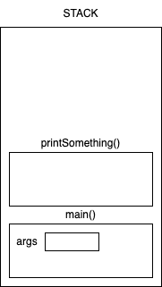
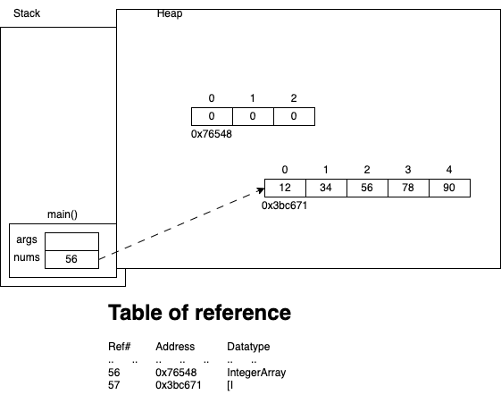

# Control structures in Java

1. Sequence (of execution)

    - By default the code gets executed from top to bottom, starting from the main() method
    - We can change the sequence by creating methods (or functions) and calling the same.

    ```
        [access-modifier] <return-type> <method-name>([param1, param2, ...]) {
            // method body
            [return] [return-value];
        }
    ```

    For example,

    ```java
        public long square(int n) {
            return n*n;
        }
        void sayHello() {
            System.out.println("Hello, world!");
        }
        public void setAge(int age){
            if(age<1 || age>120){
                System.err.println("Invalid value for age - " + age);
                return;
            }
            this.age=age;
        }
    ```

    

1. Selection

    - Allows conditional execution of code
    - `if-else` and `switch-case`

    ```java
        if(condition) {
            statements;
        }

        if(condition) {
            statements;
        }
        else {
            statements;
        }

        // nesting of if statements
        if(condition) {
            statements;
            if(condition) {
                statements;
                if(condition) {
                    statements;
                }
            }
        }

        // chain of if statements
        if(condition1) {
            statements1;
        }
        else if(condition2) {
            statements2;
        }
        else if(condition3) {
            statements3;
        }
        else {
            statements4;
        }

        // I generally avoid the above, and use this instead:
        if(condition1){
            statements1;
            return;
        }
        if(condition2){
            statements2;
            return;
        }
        if(condition3){
            statements3;
            return;
        }
        statements4;
        // assuming that there is no code to be executed after the if-else statements
    ```

1. Iteration

    - AKA loops
    - Three types of loops
    - `for`

        - most commonly used when you know the number of iterations to perform
        - generally used with arrays

        ```java
        for(expr1; expr2; expr3){
            // statements-to-repeat
        }
        ```

        - expr1
            - is called loop initializer.
            - Generally the loop counter variable is declared and initialized.
            - Executed only once
        - expr2
            - must be a boolean expression.
            - checked before executing the loop block everytime
        - statements-to-repeat
            - logic to be performed in the loop
        - expr3
            - loop control statement.
            - either increments or decrements the loop counter variable

    - `while`
        - used when we do not know the number of iterations in advance
        - the loop execution depends on some changes with in the loop body
        - a `for loop` without expr1 and expr3 can still be used as a `while loop`
        ```java
            for(; condition; ){
                statements;
            }
        ```
    - `do-while`
        - the loop body is executed at least once with out any condition
        ```java
        do {
            statements;
        }while(condition);
        ```

## Arrays



## Classes and Objects

-   Different kinds of classes:
    -   programs - a class with a `public static void main(String[] args)` method
    -   entity or model - class which represent information (for example, Customer, Employee, Supplier, Book, Department, ..)
    -   dto - data transfer objects, similar to entity or model classes
    -   service - class that contain business logic methods (AccountService, CustomerSerivce, etc.)
    -   repository or dao - class that contain logic to persist (store and access) data (usually from databases)
    -   utilities or helper - class that contain small reusable logic that may be used by service or dao classes
    -   and many other

So, the packages are created based on what kind of a class we are creating.

For example, `com.targetindia.entity.Product` or `com.targetindia.web.servlet.LoginServlet` or `com.targetindia.controller.rest.EmployeeController`

