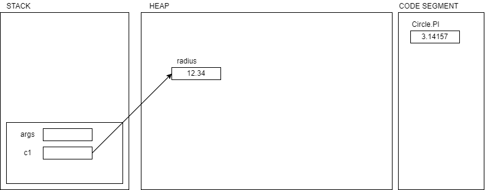

# Static members

- When a variable is marked as `static`, it belongs the class and not to the object
- For example, if you create multiple objects of `Circle`, there are multiple `radius`, but there is only on `PI` variable in the memory (code segment, along with the actual code like methods and constructors, class defs etc are loaded)
- If they are public, then you may access them using the name of the class
  - `Circle.PI`
- While static members (variables/methods/classes) can be accessed inside a non-static method, the vice-versa is not possible
  - a non-static member cannot be accessed inside a static method
    - this is the reason we have written static methods while using them in the main() method.
