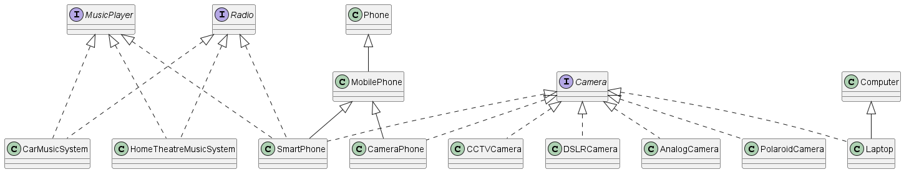
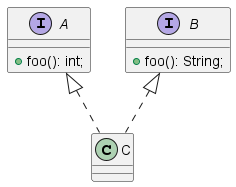
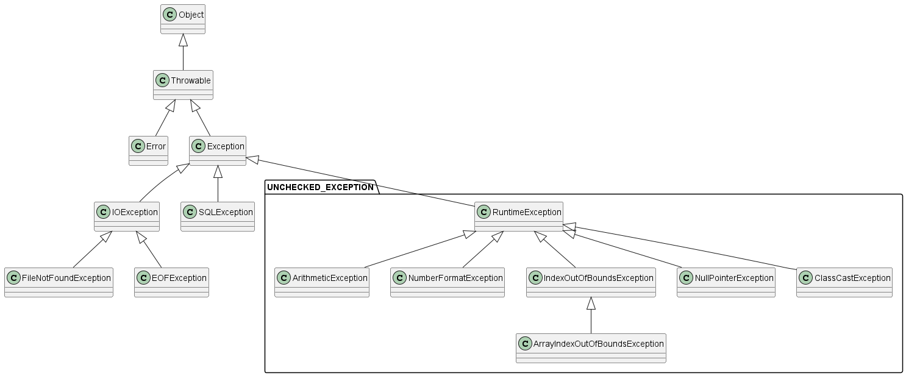

# Interfaces

- A user defined data type
- Can contain variables and methods
  - variables must be (or going to be) `public static final`
  - methods must be (or going to be) `public abstract`
    - Java 8 introduced the concept of `default` methods
    - default methods contain method body - and hence they are not abstract!!
- An interface does not have a constructor
  - and hence we cannot create an object of an interface
- We can **realize** an object of an interface in the form of an object of a class that implements the interface



## Difference between and **abstract class** and an **interface**

- An abstract class is used for ineritance
  - the intension here is **code reusability**
- An interface is used for polymorphism
  - the intension here is to enforce common contract across unrelated classes
  - For example, `SmartPhone` and `DigitalCamera` and `Laptop` are totally unrelated classes, but all of them can be used as a `Camera` provided they all implement the `Camera` interface.
- An abstract class may have non-static member variables
- An interface cannot have non-static member variables
- The default methods in the interface should not be used in the context of inheritance, but should only be a fallback method.
- An abstract methods may contain methods that are private/protected or public
- An interface methods must be public

_When a class implements an interface, it is equivalent to extending an abstract class with only abstract methods_

Also, a class can implement multiple interfaces. Because of this, it is often said that Java supports multiple inheritance (WRONG!!).

Implementing multiple interfaces must be done with great caution.



Problem - _What to implement / overrid in class C?_

Solution - _Choose between interface A and interface B_

# Exceptions

- An exceptional scenario is a an error that occurs during the execution of the program.
- Compiler only checks for syntax errors
- During the execution of the program, the JRE or part of the application or API may cause an error, which in most cases can be handled.
  - For example, you are trying to open and read a file using the name and path of the file,
    - but that file may not exist
    - the file exists, but you do not have access permission
    - the filename exists, but is a directory not a file
  - This particular scenario is faced by the Java IO api, and will create an object of a suitable class, and **throws** that object to you
    - if the object thrown is not **caught** and handled by your code, then the same is re-thrown to the JRE, and JRE will break the execution of the program and reports the entire stack trace with the error message (if any)




### Handling exceptions

```java
try {
  // statements
}
catch(Exception e){
  // handle exception
}

try {
  // statements
}
finally {
  // cleanup activities
}

try {
  // statements
}
// additional catch blocks here
catch(Exception e){
  // handle exception
}
finally {
  // cleanup activities
}
```