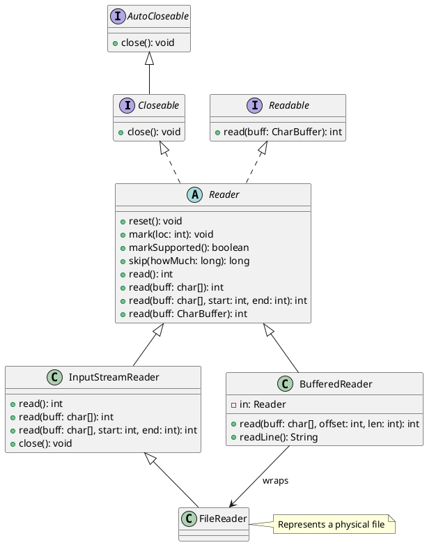

# Reading and writing using text files

```plantuml
@startuml

interface Closeable{
    + close(): void
}
interface AutoCloseable{
    + close(): void
}
interface Readable{
    + read(buff: CharBuffer): int
}

AutoCloseable <|-- Closeable
Closeable <|.. Reader
Readable <|.. Reader

abstract class Reader {
    + reset(): void
    + mark(loc: int): void
    + markSupported(): boolean
    + skip(howMuch: long): long
    + read(): int
    + read(buff: char[]): int
    + read(buff: char[], start: int, end: int): int
    + read(buff: CharBuffer): int
}

class InputStreamReader {
    + read(): int
    + read(buff: char[]): int
    + read(buff: char[], start: int, end: int): int
    + close(): void
}

Reader <|-- InputStreamReader
InputStreamReader <|-- FileReader
Reader <|-- BufferedReader

class BufferedReader {
    - in: Reader
    + read(buff: char[], offset: int, len: int): int
    + readLine(): String

}

BufferedReader --> FileReader: wraps

note right of FileReader: Represents a physical file

@enduml
```

