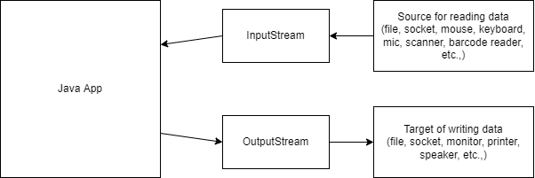

# InputStream and OutputStream

- Introduced in version 1.0
- In version 1.1, a new set of APIs were introduced to work with character data
- Character streams and Byte (binary) streams
- Character streams (1.1 +)
  - classes that deal only with character data
  - Reader and Writer are the super classes
- Binary or Byte streams (1.0)
  - classes that deal with non-textual data (such as integer, float, Boolean or object)
  - Examples of such files: images, video, audio, pdf (anything other than text files)
  - There are classes that still can be used with text data, but it is recommended that we use Reader and Writer classes for text data

```plantuml
@startuml

abstract class InputStream {
    + read(): int
    + read(bytes: byte[]): int
    + read(bytes: byte[], offset: int, len: int): int
    + available(): int
    + close(): void
}

AutoCloseable <|-- Closeable
Closeable <|... InputStream

InputStream <|-- ByteArrayInputStream
InputStream <|-- FilterInputStream
InputStream <|-- FileInputStream
InputStream <|-- SocketInputStream
InputStream <|-- ObjectInputStream
FilterInputStream <|-- BufferedInputStream
FilterInputStream <|-- DataInputStream


class DataInputStream {
    + read(): int
    + readByte(): byte
    + readShort(): short
    + readInt(): int
    + readLong(): long
    + readFloat(): float
    + readDouble(): double
    + readBoolean(): boolean
    + readChar(): char
    + readLine(): String
}

note right of DataInputStream: The readLine() method is deprecated
@enduml
```

