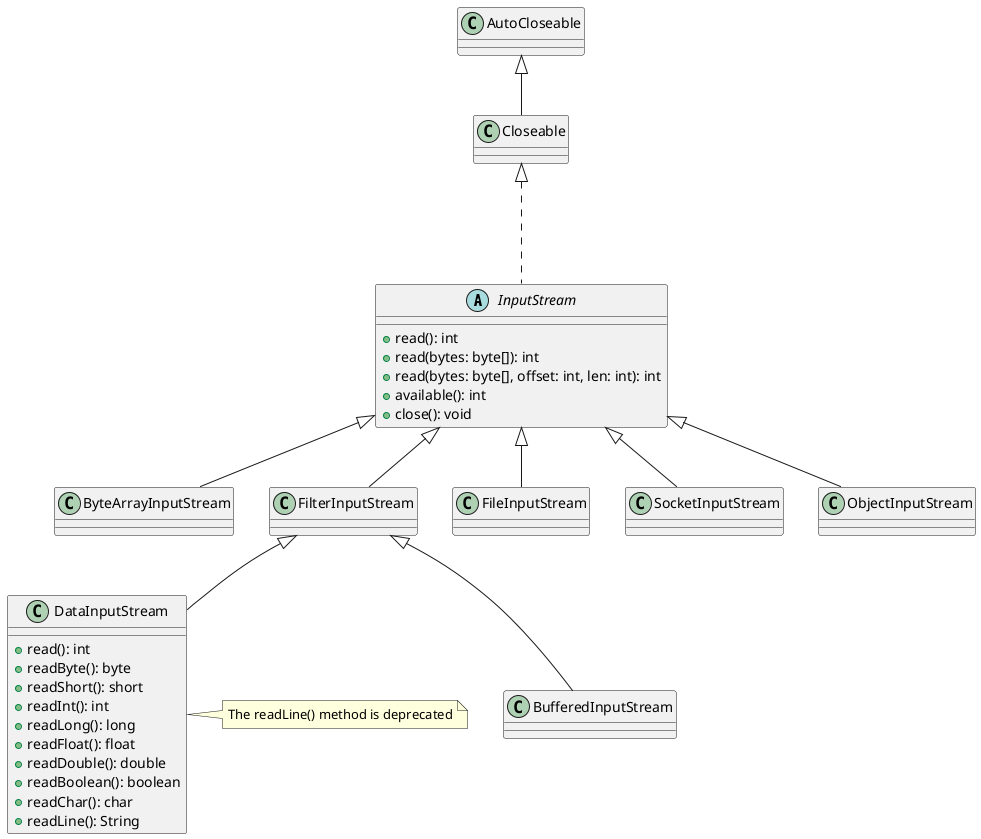

# InputStream and OutputStream

- Introduced in version 1.0
- In version 1.1, a new set of APIs were introduced to work with character data
- Character streams and Byte (binary) streams
- Character streams (1.1 +)
  - classes that deal only with character data
  - Reader and Writer are the super classes
- Binary or Byte streams (1.0)
  - classes that deal with non-textual data (such as integer, float, Boolean or object)
  - Examples of such files: images, video, audio, pdf (anything other than text files)
  - There are classes that still can be used with text data, but it is recommended that we use Reader and Writer classes for text data

