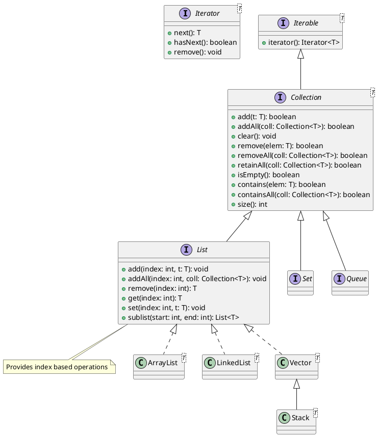

# Collections in Java

## Arrays

- a collection of values of similar data types
    `int[] nums = {10, 20, 33, 40};`
    `String[] names = {"Vinod", "Shyam"};`
    `Person[] people = {new Person("Vinod", "vinod@vinod.co"), new Person("Shyam", "shyam@xmpl.com")};`
- dynamically created, during the runtime.
- memory required for an array can be determined at the runtime, and the allocation of the required memory is done in the heap.
- once the array is crated, it cannot grow or shrink in size
- an array occupies continuous bytes in the heap. For eaxmple, if you create an array of a million double values, then the required memory space is 8 million bytes
- insertion and deletion of values at random indexes are difficult operations

## Collection framework

- introduced in the very first release of Java, to overcome the problems related to arrays, especially the redundant functionalities (like insert, remove, set, get, etc)
- in version 1.2, they did refactor and introduced a lot of new interfaces and implementations for the same. The old classes of version 1.0, went through changes too.
- in version 1.4, they introduced new features like `RandomAccess`
- in version 1.5 they introduced the concept of __generics__, which allows us to create collections of homogeneous types as against the heterfogeneous types.
    - Up to version 1.4, a Vector is a collection of objects (that may include numbers, strings, custom objects etc.)
    - Since 1.5, a Vector is a collection of either Integers, Strings or Custom objects
- in version 1.8, Java introduced a new set of APIs to work with huge amount of data in collections, called 'Streams' API.
    ```java
    // 1.0
    public class Vector implements Cloneable, Serializable {

    }

    // 1.2
    public class Vector extends AbstractList implements List, Cloneable, Serializable {

    }

    // 1.4
    public class Vector extends AbstractList implements List, Cloneable, Serializable, RandomAccess {

    }

    // 1.4
    public class Vector<T> extends AbstractList<T> implements List<T>, Cloneable, Serializable, RandomAccess {

    }
    ```

High level illustration of various classes and interfaces that makes the collection framework:




1. ArrayList
    - since 1.2
    - uses an array of objects to hold the data
    - by default the initial capacity is 10
    - when the number of elements exceeds the capacity, new array is allocated with double the current capacity, and old values are copied to the new array, and allows more addition of elements
    - accessing an element from an array is always faster than other data structures like linked lists.
    - __this should be the default choice for a List__
    - insertion and deletion at random indexes are time consuming

1. LinkedList
    - since 1.2
    - internal storage is a doubly linked list
    - each node in the list are separate objects, and do not necessarily occupy continuous memory (as against an array)
    - insertion and deletion operations at radom index is faster than that of an array (especially insert and delete at index 0)
    - accessing an element at random index may be slower than that of an array
    - use this implementation only when __insert and delete at 0 index__ is more frequent than accessing elements at random indexes
1. Vector
    - since 1.0
    - a.k.a legacy collection
    - internal mechanism is same as __ArrayList__
    - some of methods are marked as _synchronized_, which has some overheads, but they are needed if the collection is shared among multiple threads
    - use this implementation only if the list is shared by multiple threads that may mutate the data
1. Stack
    - since 1.0
    - provides the standard _STACK_ operations such as _push()_ or _pop()_ etc.


It's a good practice to use the itnerface names for function's parameters and return types.

For example,

```java
    public List<Employee> findByCity(String city) {
        // logic here
        return ...
    }
```

The above method may return (is allowed to return) an object of:
1. ArrayList
1. Vector
1. LinkedList
1. Stack
1. or any other class that implements `java.util.List` interface

However, 

```java
    public ArrayList<Employee> findByCity(String city) {
        // logic here
        return ...
    }
```
the above function can only return an object of 
1. ArrayList
1. or any subclass of ArrayList