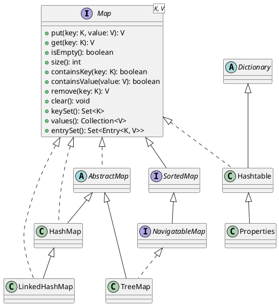
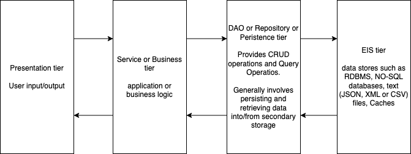

# Functional programming 

- A function is a first class object (in languages that support functional programming)
- You can pass a function as an argument of a function
- You can return a function from anohter function
- You can assign a function to a variable
    - not in Java

## Functional interface

- An interface with exactly 1 abstract method
- Can also be annotated with `@FunctionalInterface`
- In Java, we can assign an object of any interface to a variable
    - Since in a functional interface, there is exactly 1 abstract function signature, we can assign an implementation for that function to a variable of a functional interface

For example, the interface called `java.lang.Runnable` has one abstract method `public void run()`.

```java
Runnable r1 = new Runnable() {
    public void run(){
        System.out.println("Hello");
    }
};

// idea is
Runnable r2 = public void run(){
    System.out.println("Hello");
};
// should be done as
Runnable r2 = ()->{
    System.out.println("Hello");
};
// can be simplified as
Runnable r2 = ()->System.out.println("Hello");
```

If the method body has only one statement, then we do not need the curly braces. If the olny statement is a return statement, then the return keyword is also not required.

```java
Comparator<Book> cmp = new Comparator<>(){
    public int compare(Book b1, Book b2){
        return Double.compare(b1.getPrice(), b2.getPrice());
    }
}
// can be simplified as 
Comparator<Book> cmp = (Book b1, Book b2) -> {
        return Double.compare(b1.getPrice(), b2.getPrice());
    };

// can further be simplified as 
Comparator<Book> cmp = (b1, b2) -> {
        return Double.compare(b1.getPrice(), b2.getPrice());
    };

// can further be simplified as 
Comparator<Book> cmp = (b1, b2) -> Double.compare(b1.getPrice(), b2.getPrice());
```


# Key/value based data structures in Java

- Unlike a Collection, which is just a bunch of objects, Map is a bunch of objects stored with a unique key
- Key in a Map cannot be duplicate
    - Depending on the implementation of Map, the data type of Key must either
        - implement Comparable (TreeMap)
        - provide hashCode and equals methods (HashMap, Hashtable, LinkedHashMap)
- Map can produce different types of Collection
    1. Set of keys 
    1. Collection of values
    1. Set of Entry (key/value pair)



### Different implementations of Map

1. HashMap
    - Uses an array called buckets
    - A bucket contains the value corresponding to a key, and the index of the bucket is determined by the key
        - so, if two keys are identical then they correspond to the same index of the bucket, 
        - for example, 
        ```java
            m.put("vinod", "bangalore");
            m.put("vinod", "shivamogga"); 
        ```
        Here "vinod" as a key would generate an index where initially, "bangalore" is stored. When the second `put` is called, on the index, "shivamogga" will be placed, overwriting "bangalore".
    - Refer https://en.wikipedia.org/wiki/Hash_table for more details
1. LinkedHashMap
    - Uses a linked list
    - uses the hashCode and equals of keys to check for duplicates
1. TreeMap
    - uses red-black tree
    - depends on Comparable to compare two keys
1. Hashtable
    - legacy (version 1.0)
    - HashMap is a derivative of this
    - some methods are synchronized, and hence this is preferred in a multithreaded applications
1. Properties
    - subtype of Hashtable
    - key/value pair of strings


