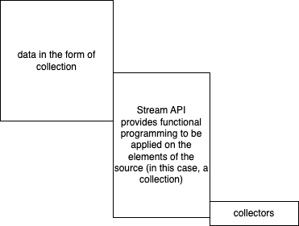

# Unit testing using JUnit

- Current version is 5.9
- Popularly known as JUnit 5
- Version 4 introduced the use of Annotations to defines test cases
- Version 3 used coding conventions to define test cases
  ```java
  public class FactorialTests {
      public void setUp(){
          // some initialization
      }
      public void tearDown(){
          // some cleanup activities
      }
      public void test01_001(){
          // test case method should start with prefix of 'test'
      }
  }
  ```
- Most IDEs are integrated with JUnit platform
  - can run tests directly from the IDE
- When using CI/CD, we won't have any IDEs, so we use maven to run the tests
  `mvn test`
  - You must download the maven binaries
  - make sure that the `mvn` executable is in the PATH

Maven dependencies required for a JUnit setup:

```xml
    <dependency>
        <groupId>org.junit.jupiter</groupId>
        <artifactId>junit-jupiter-engine</artifactId>
        <version>5.9.3</version>
        <scope>test</scope>
    </dependency>
    <dependency>
        <groupId>org.junit.platform</groupId>
        <artifactId>junit-platform-runner</artifactId>
        <version>1.9.3</version>
        <scope>test</scope>
    </dependency>
```

In order to execute `mvn test` command for running test cases, we also need `maven-surefire-plugin`

```xml
    <build>
        <plugins>
            <plugin>
                <groupId>org.apache.maven.plugins</groupId>
                <artifactId>maven-surefire-plugin</artifactId>
                <version>3.0.0-M3</version>
            </plugin>
        </plugins>
    </build>
```

The result of executing a test case:

1. test passes (no assertion errors)
1. test fails (assertion error)
1. error (unhandled exceptions from the method being test)

# Streams in Java 8+



- a stream represents a sequence of elements
- supports different kinds of operations (in the form of functional programming)
- helps us perform computations

## Functional programming

- allows us to use a function as an object, so that we can return it from a function, or pass it to a function as argument
- arrow functions are nothing but an object of an interface with a single abstract function
  - such interfaces are called as functional-interface, and are/may be marked with @FunctionalInterface

### Functional interfaces that are used with Streams

1. Predicate: has an abstract method that accepts a parameter and returns a boolean
   - useful while filtering data
1. Consumer: has an abstract method that accepts a parameter and does not return anything
   - useful when we just want to debug or print the value

### Important notes:

- Stream operations can be `intermediate` or `terminal`
  - intermediate - return streams, so that we can do chain operations
  - terminal - return either void or non-streams (like a List for example)

```java
names
        .stream()
        .filter(name -> name.startsWith("A"))
        .sorted()
        .forEach(System.out::println); // forEach directly calls the println method of System.out and passes the parameter
```

- in the above example,
  - `filter`, `sorted` are intermediate operations
  - `forEach` is a terminal operation
