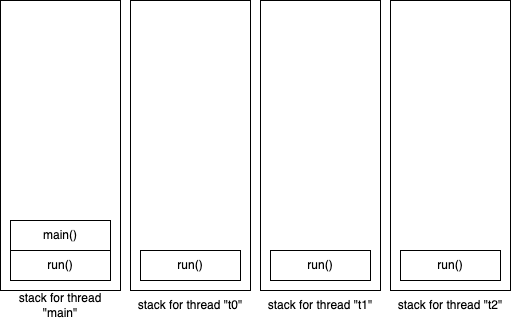

# Multithreading in Java

- a process is a program under execution
- a thread is a separate line of code execution with in a program
- we can create a thread by extending `java.lang.Thread` or providing a method body called `public void run()` to a thread object in the form of an object of `java.lang.Runnable`
- every thread has it's own stack, which contains the method calls and local variable of those methods
- all threads of a program share common memory space and because of which we may run into race conditions and deadlocks.
  - synchronization is a way to avoid such common problems, and developers also must be vigilant

When we call the `start()` method on a thread object (for example, mt1.start()), many important steps are taken to start the execution of the thread.

1. thread initialization
1. thread activation
   - state is set to 'runnable'
   - ready for execution, but can not just start the execution yet
   - actual start time depends on thread scheduler, which determines the order in which the threads are granted the CPU time
1. thread scheduler
1. thread execution
   - scheduler picks a thread for execution
   - state of the thread now is 'running'
   - calls the run() method of the thread, which is the entry point for the execution
1. concurrent thread execution
1. thread termination
1. cleanup and resource release

### Thread states

- New
  - you have create the thread object, but haven't called the start() method yet
- Runnable
  - the thread is eligible to run
  - not currently under execution
  - thread scheduler determines when it gets the CPU time
- Running
  - currently CPU is executing the run() method of the thread
- Blocked/ Waiting
  - ex: waiting for the user to input via the keyboard
  - Object's wait() and notify()/notifyAll() methods
- Timed Waiting
  - the wait or block is only for a known amount of time
  - ex: use of sleep() or join() methods
- Terminated
  - run() method is over
  - once terminated, we cannot use the thread object anymore (as a thread with separate line of execution)
