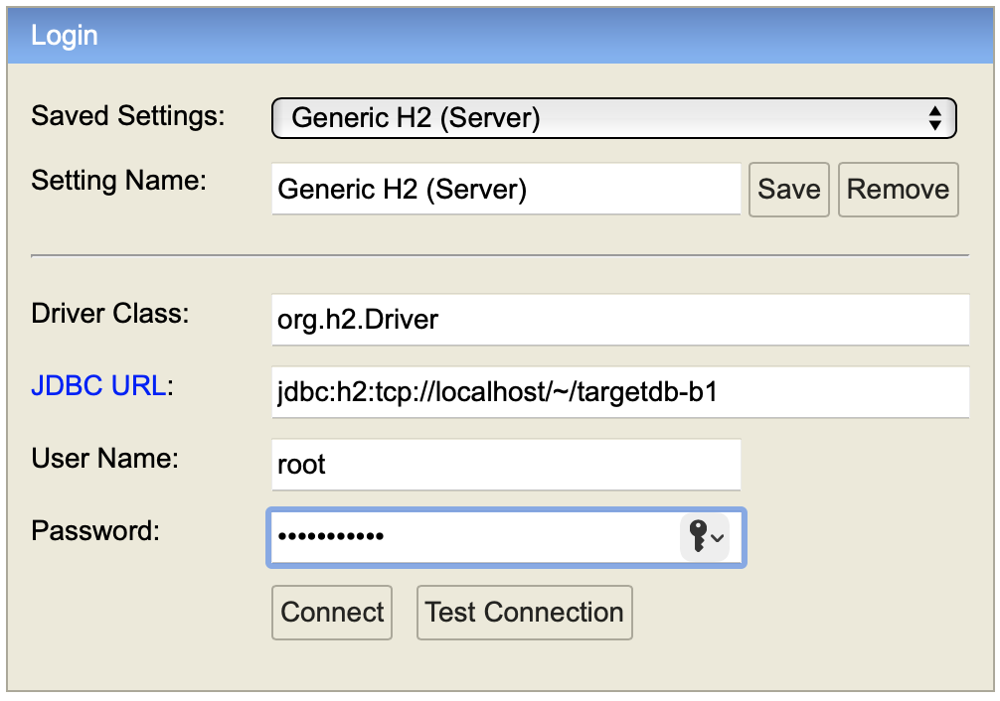
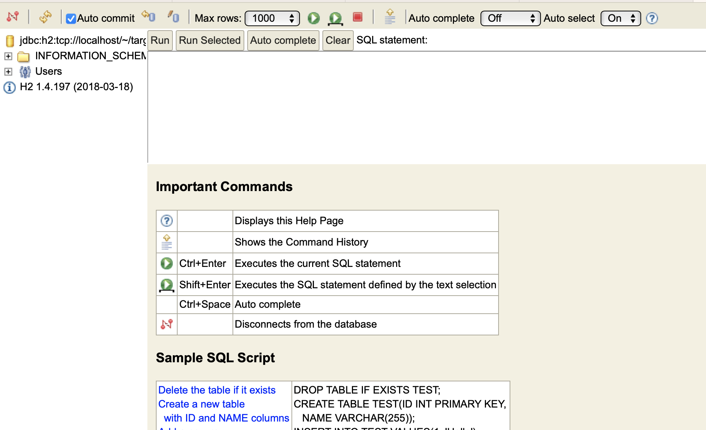

# SQL and JDBC

## Setting up of h2 database

- download the h2(1.4.197) JAR file (https://repo1.maven.org/maven2/com/h2database/h2/1.4.197/h2-1.4.197.jar)
  - or add a dependency in pom.xml (required for JDBC applications)
  ```xml
      <dependency>
          <groupId>com.h2database</groupId>
          <artifactId>h2</artifactId>
          <version>1.4.197</version>
      </dependency>
  ```
- open a command prompt (terminal) and `cd` into the directory consisting the downloaded JAR file and run the command `java -jar h2-1.4.197.jar`
  ```sh
      $ cd /Users/vinod/Downloads
      $ java -jar h2-1.4.197.jar
  ```
  - this runs an RDBMS server written in Java, and also opens a browser, loads `http://localhost:8082` where we can access a client program to connect to a database (with in the database server)
- alternately, instead of executing a java command in a command prompt, we can simply double click the JAR file, and it will do the exact same thing.



To connect to the server using the web client, use the following information:

- Select "Generic H2 (Server)" option for "Saved Settings"
- Driver Class: `org.h2.Driver`
- JDBC URL: `jdbc:h2:tcp://localhost/~/targetdb-b1`
  - `targetdb-b1` is going to be a new database (a file with the same name and `.mv.db` extension will be created under your home directory /Users/vinod)
- Username: `root`
- Password: `Welcome#123`
  - for the time, you are going to set the username and password



# SQL DDL commands

- Data Definition Language
- allows you to create db objects (such as tables, views, indexes, users, sequences, etc)
  - CREATE
  - ALTER
  - DROP

### Creating a table

```sql
CREATE [IF NOT EXISTS] TABLE {tablename} (
    column_definition
)
```

where a `column_definition` includes

- name of the column
- data type of the column

and optionally,

- size of the column
- primary key
- not null
- check ({condition})
- default {default_value}
- references ({table/column})

For example,

```sql
create table products (
    id int primary key auto_increment, -- id cannot be null or id cannot be repeated
    name varchar(30) not null,
    category varchar(20),
    quantity_per_unit varchar(50),
    unit_price double check (unit_price>=0),
    units_in_stock int default 10 check(units_in_stock>=0)
);
```

Example for altering the table structure (we want to add a new constraint UNIQUE for the name column)

```sql
alter table products
add constraint name_unique unique(name);
```

### DML commands

- Data Manipulation Language
- allows you to work with the content of a table
  - INSERT
  - UPDATE
  - DELETE

Examples for INSERT command

```sql
insert into products (name, category, quantity_per_unit, unit_price) values ('Chai', 'Beverages', '100gm pack', 129.0);


insert into products (name, category, quantity_per_unit, unit_price) values
('Chang', 'Condiments', null, 92.0),
('Diet coke', 'Beverages', '6 x 200ml tin', 176.0);


```

Example of UPDATE command:

```sql
update products
set quantity_per_unit = '150 gm pouch',
units_in_stock = 18
where id=3;

```

# JDBC

- Java Database Connectivity
- A vendor independent API for connecting and working with any RDBMS
- This heavily depends on the concept of polymorphism
- The JDBC API provides a bunch of interfaces and few classes (part of `java.sql` package)
  - interfaces:
    - `Driver`
    - `Connection` (allows to open a channel of communication, so that we can send SQL commands to the server)
    - `Statement` (represents an object that is capable of sending SQL commands to the server and collect the response from the server)
      - `PreparedStatement` (pre compiled `Statement`)
        - `CallableStatement` (used for executing stored procedures and function)
    - `ResultSet` (represents the result of SELECT command)
    - `ResultSetMetadata` (contains information about the result itself)
    - and many more
  - classes:
    - `DriverManager` (a class that has static (factory) methods to get a connection to the database server )
    - `Types` (has mappings to database data types)

## Types of JDBC Drivers

- Type 1 driver
  - JDBC-ODBC bridge
  - ODBC is written in C/C++
  - ODBC maintains/establishes a connection to the RDBMS
  - JDBC api can communicate with the ODBC DSN (data source name) created in the ODBC app
  - An example JDBC url for this type of connection: `jdbc:odbc:MYSQL_DSN`
- Type 2 driver
  - Native API/ Partly Java driver
  - Here Native is the vendor implementation (such as Oracle)
  - For example, if we want to connect to an Oracle remote server, we have to install oracle client software on our laptop, which is called the Native API
  - JDBC api communicate with the native api (written in C/C++)
- Type 3 driver
  - Network protocol driver/ middleware driver
  - On the client we only need JDBC api, which communicates with middleware server (native api), which then communicates to the actual RDBMS server
- Type 4 driver
  - Thin driver/ 100% Java driver
  - vendors provide a JAR file consisting of the JDBC interface implementations
  - no vendor api installation required on the client
  - this is the only one currently people use
  - a typical JDBC url looks like: `jdbc:mysql://localhost:3306/mydb`


```sql
create table employees(
    id int primary key,
    first_name varchar(20) not null,
    last_name varchar(20),
    email varchar(50) unique,
    phone varchar(50) unique,
    salary double check (salary>=25000),
    department varchar(30) default "ADMINISTRATION"
)
```