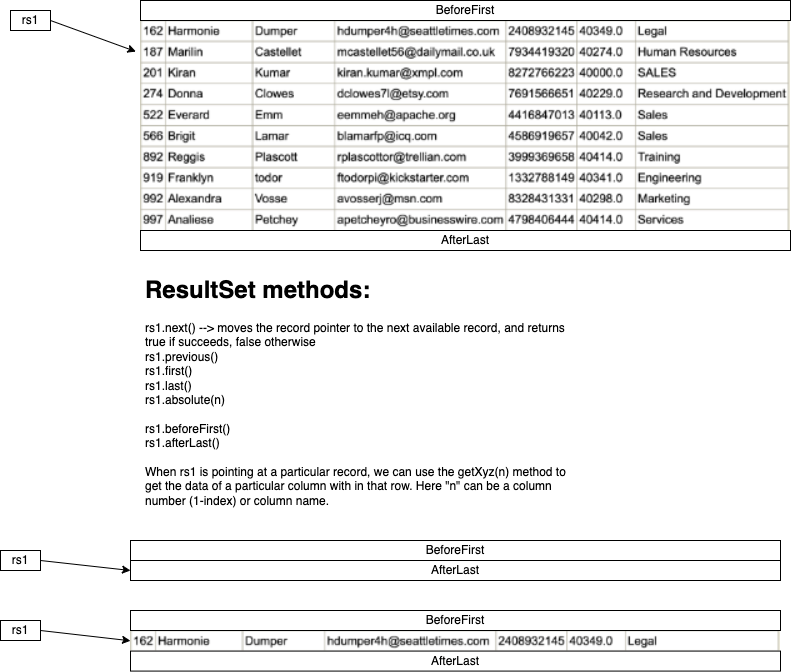

# PreparedStatement, ResultSet, ResultSetMetaData and DatabaseMetaData

## PreparedStatement

```java
    String sql = "insert into employees (id, first_name, last_name, email, phone, salary, department) " +
        "values (?, ?, ?, ?, ?, ?, ?)";
    PreparedStatement stmt = conn.prepareStatement(sql);
```

When we execute the above statement, the JDBC driver sends the SQL statement to the db server for `preparation`. The preparation process involves several steps performed by the DB server:

- **Parsing**: the DB server receives the command sent by the client, and begins the parsing process. It breaks the sql command into its parts such as keywords, table names, column names, operators, parameters, values etc. This step ensures that the db server understand the structure and the syntax of the statement given
- **Syntax validation**: after parsing, the db server performs syntax validation. This ensures that the sql command adheres to the rules of the database's dialect. It checks for proper syntax, correct keyword usage, valid identifiers. If any syntax errors are detected, an exception is raised.
- **Semantic analysis**: existence of tables and columns, column count, etc are being checked
- **Security checks**: Checks the user's privileges for the requested operation on the requested table
- **Generate execution plan**: An execution plan may involve selecting an appropriate index, join tables in an optimal order, using cached data. The goal is to execute the statement in the most efficient manner possible, considering the factors like - performance, resource utilization and query complexity
- **Parameter placeholder recognition**: Reserves memory for the `?` placeholders, so that at later point in time, those memory areas can be filled with values, and then the command can be executed

### ResultSet




### Using stored procedures

```sql
-- this procedure receives first_name, last_name, email, phone, department as parameters
-- and generates a new id based on the current max id, and uses the minimum salary in that department as salary
-- if the department is does not exist, then the salary is assumed to Rs.35000/-
delimiter $$
drop procedure if exists add_new_employee;

create procedure add_new_employee(
    p_first_name varchar(50),
    p_last_name varchar(50),
    p_email varchar(50),
    p_phone varchar(50),
    p_department varchar(50),
    p_new_id out int,
    p_new_salary out double
)
begin
    select max(id)+1 into p_new_id from employees;
    select min(salary) into p_new_salary from employees where department=p_department;
    if p_new_salary is null then
        set p_new_salary = 35000;
    end if;

    insert into employees (id, first_name, last_name, email, phone, salary, department)
        values (p_new_id, p_first_name, p_last_name, p_email, p_phone, p_new_salary, p_department);
end
$$

```

to call the above stored procedure use the `call` command

```sql
call add_new_employee('Hari', 'Rao', 'harirao@xmpl.com', '8276000234', 'Sales')
```

To execute this stored procedure from Java, we use the `CallableStatement` interface.

