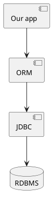

# ORM - Object Relational Mapping

- ORM is a tool/technique to help developers work with RDBMS effectively and seamlessly
- Provides a high level abstraction and hides the JDBC part of working with databases

### Popular ORM frameworks in Java

- Hibernate ORM
- Mybatis (SQL mapper, not a complete ORM)
- Java Persistence API (JPA) - standard ORM API by JCP (Official Java)
  - implementations include:
    - Hibernate
    - Eclipselink
    - Apache OpenJPA
    - Toplink from Oracle

## What is Hibernate ORM?

- Popular and widely used ORM framework for Java
- Provides a convenient and efficient way to map a Java object to a record of a relation (table in an RDBMS)
- Some of the most important interfaces provided by hibernate orm:
  - SessionFactory - creates an object of an interface called Session
  - Session - an object of this represents a DB connection
    - provides methods for performing CRUD operations
    - save(), saveOrUpdate(), persist() --> adding a new record to the db using an object
    - get(), load() --> returns an object representing data of a record in a table
    - update(), saveOrUpdate(), merge() --> executes an SQL UPDATE command for updating a record in the db for the given object
    - delete(), remove() --> deletes a record in the table corresponding to the object given
  - Query - an object that can be used to query for the entity objects
