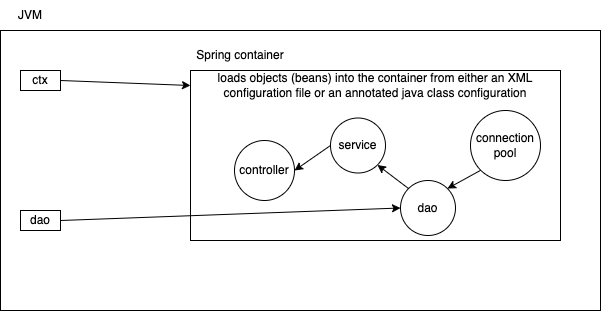
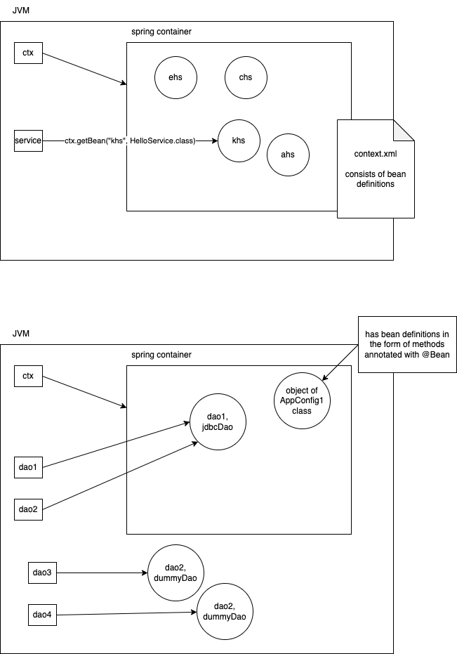

# Spring framework

- a very popular java framework for creating enterprise applications
- open source and free (currently maintained by VMware Tanzu)
- created by Rod Johnson in 2004
  
  - Wanted to replace the use of EJB (Enterprise Java Bean) for developing J2EE application
    - EJB?
      - A standard framework/api from `JCP` (Java Community Process)
      - very complex architecture
      - 3 types of beans existed - session beans (stateless/ stateful), entity beans (BMP, CMP), message driven beans
      - need run the EJB applications on some kind of application servers, provided by 3rd party vendors (ex, BEA WebLogic, IBM WebSphere, Sun's GlassFish, RedHat's JBoss/WildFly)
      - these servers provide a lot of services that our applications (EJBs) can make use of
        - for example, a DB connection pool or a JNDI service
    - It was possible that we may have a very simple application that doesn't need all those services, but still the application server loads all those services and keeps it ready
      - this makes the application server very heavy on footprint on memory and CPU
  - Spring makes application development easier by modularizing the need of services
    - your application can specify and use only the services needed
    - the application server itself is no longer needed, and the services offered by by the servers are now available as modules that we can simply plug-in to our application

## Features of Spring framework

- IOC (Inversion of Control)
  - traditional programming - your code calls api functions
  - IOC programming - api (spring) calls your code
- Dependency injection
  - we do not create objects
  - we declare variables (mostly of interface types), and spring assigns objects to our variables
- many modules
  - we can use any of the modules as needed by our application
  - 
  - support for almost everything that JEE server's services

- A Spring container is represented by an object of an interface `org.springframework.context.ApplicationContext`
- There are many classes provided by Spring that implement this interface
  1. `org.springframework.context.support.ClassPathXmlApplicationContext`
  1. `org.springframework.context.support.FileSystemXmlApplicationContext`
  1. `org.springframework.context.annotation.AnnotatioConfigApplicationContext`

## Spring bean scopes

- singleton
  - default
  - spring creates this in advance and keeps a single object of the bean class, and is given whenever needed
    - a singleton bean can also be loaded (only once) lazily
  - garbage collected only spring container is closed
- prototype
  - beans are created on demand
  - spring may do the dependency injection and wiring, but does not maintain a reference to the same. So, if you lose the reference to the prototype bean, it is qualified for garbage collection
- request
- session
- global session

you can also create and use custom scopes
