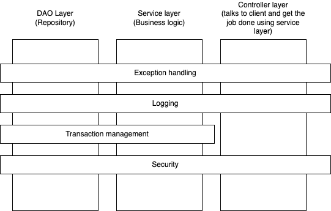
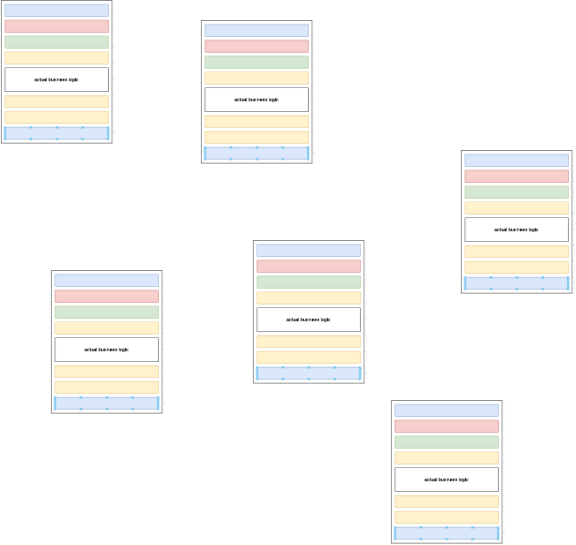
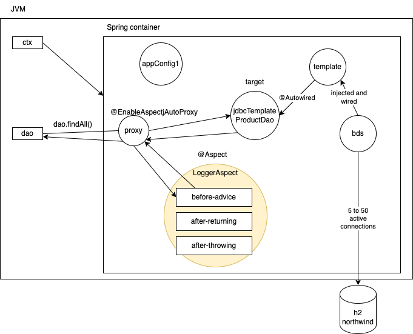

# Spring AOP

## Cross cutting concerns

- an aspect of software system that cuts across multiple layers/parts/components of the system
  - exception handling
  - logging



### Code tangling


### Code scattering



## AOP Terminologies

- Aspect
  - concern in a software product that we want to address
    - Transaction management
    - Logging
    - Security
    - Data transformation
    - Exception handling
- Advice
  - the implementation of a solution the actual concern
  - a function/method that addresses the concern such as logging
    - Before
    - After returning
    - After throwing
    - After
    - Around
- Joinpoint
  - location in your application where an advice can be applied
  - In Spring AOP, Joinpoint is always an **execution** of a method
- Pointcut

  - a subset of Joinpoints where you are actually applying an advice
  - we use AspectJ pointcut expression language to identify which function should be intercepted

  ```
  execution(modifier-pattern? return-type-pattern declaring-type-pattern.?method-name-pattern(parameter-pattern))
  ```

  Some examples of AspectJ Pointcut expressions

  ```
    execution(* int com.targetindia.dao.*Dao.find*(..))
    execution(int com.targetindia.dao.*Dao.find*(..))
    // any method starting with "find" with any access modifiers declared in any interface or class ending with "Dao" inside a package "com.targetindia.dao" with a return type of "int"

    execution(* com..ProductDao.*(..))
    // any method in ProductDao class/interface inside a package that starts with "com." irrespective of return type
  ```

- Proxy
- Target


