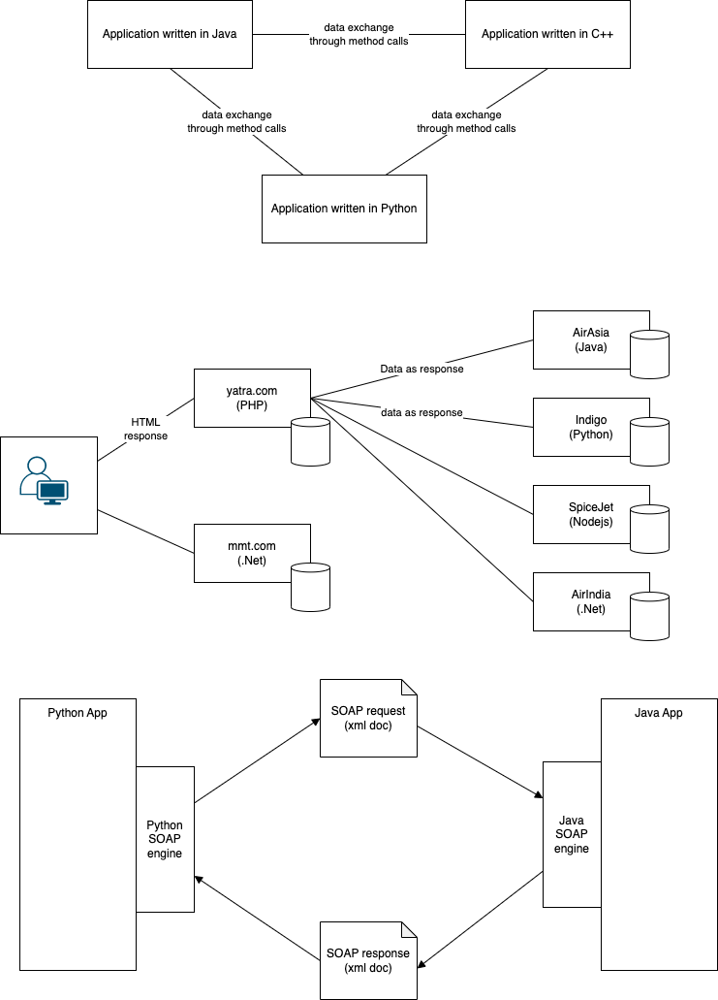
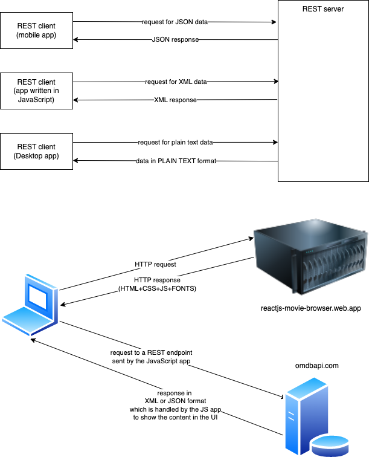
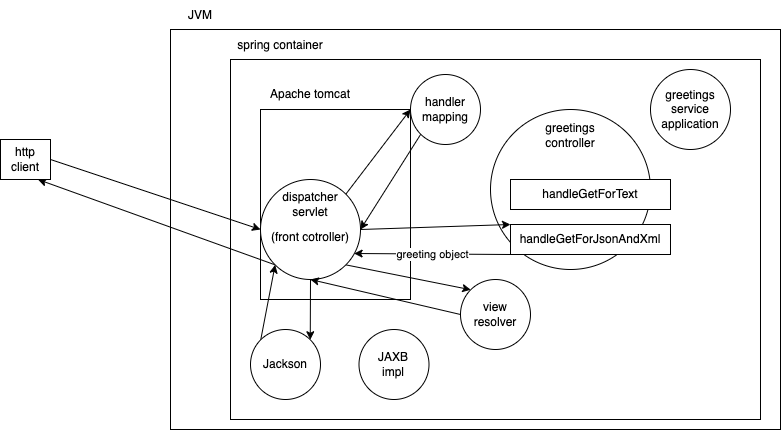

Web services

- SOAP web services (Big web services)
- REST web services

## What is a web service?

- a service offered on the web
- uses HTTP protocol
- the service itself is an application that is intended to be invoked from another application
  - the server and the client applications need not be written in the same programming language
- Interoperability



A Sample SOAP request

```xml
<Envelope>
    <Header />
    <Body>
        <getFlightData>
            <from>BLR</from>
            <to>DLH</to>
            <noOfSeats>4</noOfSeats>
            <depDate>2023-07-11</depDate>
            <roundTrip>false</roundTrip>
        </getFlightData>
    </Body>
</Envelope>
```

SOAP

- uses SOAP (XML based) protocol for standardizing messages being exchanged
- uses HTTP as a carrier protocol

## REST (Representational State Transfer)

- Transfer (exchange) of State (data) in different Representations (formats like XML or JSON (mostly used))
- Resource -> plural (products)
- State (of the resource) -> singular (one product)
- Uses only HTTP for everything (both message format as well as carrier of message)
  - URL to represent a resource (source of data/state)
    - http://example.com/api/products --> a source of data related to products
    - http://example.com/api/products/128 --> a single product with id 128
  - Headers (`Accept` and `Content-Type`) for specifying the type of data representation being exchanged (content negotiation)
    - `Accept` tells the server what representation of state the client wants
    - `Content-Type` tells the server what representation of state is sent by the client to the server
  - Verbs to trigger an action
    - GET -> retrieve the state from the resource endpoint
    - POST -> create a new entry in the resource
    - PUT -> replaces the existing data of a resource
    - PATCH -> modifies the state of one entry in a resource
    - DELETE -> deletes one or more state from the resource



### Setting up a sample REST server

- open a new command prompt (or terminal)
- make sure that you have the following files in the current directory
  - `contact-service.jar`
  - `contacts.json` (used a source of data for the REST server)
- execute the following java command:
  ```sh
  java -jar contact-service.jar
  ```
  - this runs a spring boot project and uses port 8080 to serve the client
  - the endpoint is accessible at `http://localhost:8080/api/contacts`
- if you exit the command prompt (or terminal), then the service will be stopped as well

### RFC 2616 HTTP request format

```http
<VERB> <PATH-TO-RESOURCE> [HTTP-VERSION]
REQUEST-HEADER1: VALUE1
REQUEST-HEADER2: VALUE2
REQUEST-HEADER3: VALUE3
...
...
REQUEST-HEADER-N: VALUE-N
<ONE BLANK LINE>
[REQUEST BODY OR PAYLOAD]
```

For example,

```http
GET /?s=iron&apikey=aa9e49f
Host: www.omdbapi.com
Accept: application/xml
```

The response will be in the following format:

```http
<HTTP-VERSION> <STATUS-CODE> [STATUS-MESSAGE]
RESPONSE-HEADER1: VALUE1
RESPONSE-HEADER2: VALUE2
RESPONSE-HEADER3: VALUE3
...
...
RESPONSE-HEADER-N: VALUE-N
<ONE BLANK LINE>
[RESPONSE BODY OR PAYLOAD]
```




