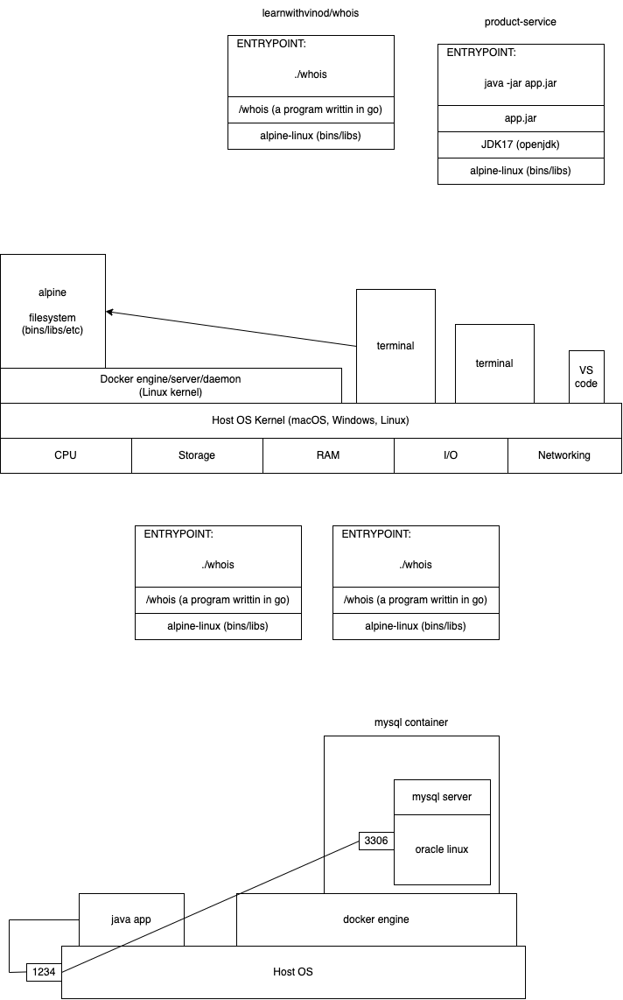

# Docker



# Some useful docker command and options

1. `docker run learnwithvinod/whois`
   - creates a container with the image `learnwithvinod/whois`
   - as long as the container's internal command is running, the container is alive (and running)
   - after that it will be cached in the container cache
1. `docker image ls` or `docker images`
   - lists all images that are currently downloaded in your computer
   - an image is downloaded when you run the `docker run` command for that image for the first time
   - an image can also be downloaded with out running, by the command `docker pull`
1. `docker ps`
   - lists all the active/running/live containers
   - use the `-a` or `--all` option to list all the stopped container too
1. `docker rm <container-id-or-name>`
   - remove the container from the cache
   - if the container is still running, this will give an error. use the `-f` option to force remove
1. `docker image rm <image-id-or-name>`
   - can be used to delete an image from the image cache. use the `-f` to force remove
1. `docker container prune`
   - remove all stopped containers with a warning/confirmation
1. `docker run -it busybox`
   - create run the busybox container and attach the local terminal to the container
   - any command issued on the terminal is executed by the container
   - have access to the filesystem of the container
1. `docker exec -it <container-name-id> <command-to-run>`
   - attaches the current local terminal to the running container and executes the given command

```sh
docker run -d -p 1234:3306 \
    --name mysql8server \
    --restart always \
    -e MYSQL_ROOT_PASSWORD=Welcome#123 \
    mysql:latest
```
